* Table of Contents
{:toc}

--------------------------------------------------------------------------------------------------------------------

## **Acknowledgements**

* Libraries used:
  * [JavaFX](https://openjfx.io/)
  * [Jackson](https://github.com/FasterXML/jackson)
  * [JUnit5](https://github.com/junit-team/junit5)

--------------------------------------------------------------------------------------------------------------------

## **Setting up, getting started**

Refer to the guide [_Setting up and getting started_](SettingUp.md).

--------------------------------------------------------------------------------------------------------------------

## **Design**

:bulb: **Tip:** The `.puml` files used to create diagrams in this document can be found in the [diagrams](https://github.com/AY2223S1-CS2103T-W16-1/tp/tree/master/docs/diagrams/) folder. Refer to the [_PlantUML Tutorial_ at se-edu/guides](https://se-education.org/guides/tutorials/plantUml.html) to learn how to create and edit diagrams.

### Architecture

The ***Architecture Diagram*** given above explains the high-level design of the App.

Given below is a quick overview of main components and how they interact with each other.

**Main components of the architecture**

**`Main`** has two classes called [`Main`](https://github.com/AY2223S1-CS2103T-W16-1/tp/tree/master/src/main/java/seedu/guest/Main.java) and [`MainApp`](https://github.com/AY2223S1-CS2103T-W16-1/tp/tree/master/src/main/java/seedu/guest/MainApp.java). It is responsible for,
* At app launch: Initializes the components in the correct sequence, and connects them up with each other.
* At shut down: Shuts down the components and invokes cleanup methods where necessary.

[**`Commons`**](#common-classes) represents a collection of classes used by multiple other components.

The rest of the App consists of four components.

* [**`UI`**](#ui-component): The UI of the App.
* [**`Logic`**](#logic-component): The command executor.
* [**`Model`**](#model-component): Holds the data of the App in memory.
* [**`Storage`**](#storage-component): Reads data from, and writes data to, the hard disk.

**How the architecture components interact with each other**

The *Sequence Diagram* below shows how the components interact with each other for the scenario where the user issues the command `delete 1`.

Each of the four main components (also shown in the diagram above),

* defines its *API* in an `interface` with the same name as the Component.
* implements its functionality using a concrete `{Component Name}Manager` class (which follows the corresponding API `interface` mentioned in the previous point.

For example, the `Logic` component defines its API in the `Logic.java` interface and implements its functionality using the `LogicManager.java` class which follows the `Logic` interface. Other components interact with a given component through its interface rather than the concrete class (reason: to prevent outside component's being coupled to the implementation of a component), as illustrated in the (partial) class diagram below.

The sections below give more details of each component.

### UI component

The **API** of this component is specified in [`Ui.java`](https://github.com/AY2223S1-CS2103T-W16-1/tp/blob/master/src/main/java/seedu/guest/ui/Ui.java)

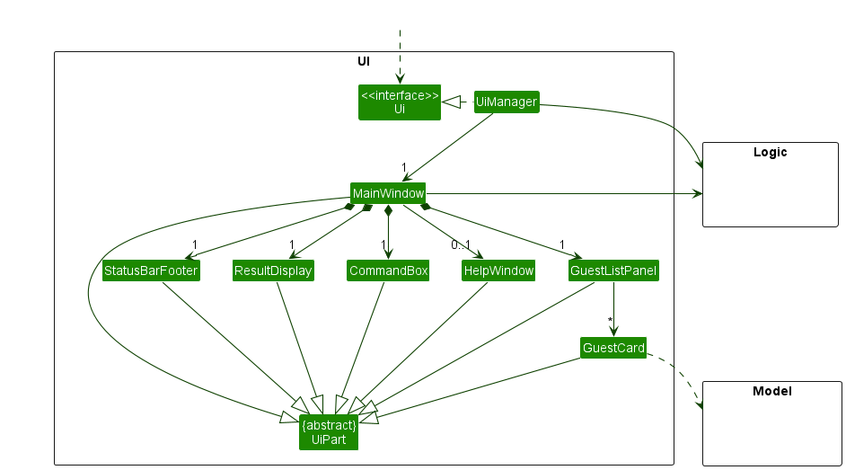

The UI consists of a `MainWindow` that is made up of parts e.g.`CommandBox`, `ResultDisplay`, `GuestListPanel`, `StatusBarFooter` etc. All these, including the `MainWindow`, inherit from the abstract `UiPart` class which captures the commonalities between classes that represent parts of the visible GUI.

The `UI` component uses the JavaFx UI framework. The layout of these UI parts are defined in matching `.fxml` files that are in the `src/main/resources/view` folder. For example, the layout of the [`MainWindow`](https://github.com/AY2223S1-CS2103T-W16-1/tp/blob/master/src/main/java/seedu/guest/ui/MainWindow.java) is specified in [`MainWindow.fxml`](https://github.com/AY2223S1-CS2103T-W16-1/tp/blob/master/src/main/resources/view/GuestListPanel.fxml)

The `UI` component,

* executes user commands using the `Logic` component.
* listens for changes to `Model` data so that the UI can be updated with the modified data.
* keeps a reference to the `Logic` component, because the `UI` relies on the `Logic` to execute commands.
* depends on some classes in the `Model` component, as it displays `Guest` object residing in the `Model`.

### Logic component

**API** : [`Logic.java`](https://github.com/AY2223S1-CS2103T-W16-1/tp/blob/master/src/main/java/seedu/guest/logic/Logic.java)

Here's a (partial) class diagram of the `Logic` component:

How the `Logic` component works:
1. When `Logic` is called upon to execute a command, it uses the `GuestBookParser` class to parse the user command.
1. This results in a `Command` object (more precisely, an object of one of its subclasses e.g., `AddCommand`) which is executed by the `LogicManager`.
1. The command can communicate with the `Model` when it is executed (e.g. to add a guest).
1. The result of the command execution is encapsulated as a `CommandResult` object which is returned back from `Logic`.

The Sequence Diagram below illustrates the interactions within the `Logic` component for the `execute("delete 1")` API call.

:information_source: **Note:** The lifeline for `DeleteCommandParser` should end at the destroy marker (X) but due to a limitation of PlantUML, the lifeline reaches the end of diagram.

Here are the other classes in `Logic` (omitted from the class diagram above) that are used for parsing a user command:

How the parsing works:
* When called upon to parse a user command, the `GuestBookParser` class creates an `XYZCommandParser` (`XYZ` is a placeholder for the specific command name e.g., `AddCommandParser`) which uses the other classes shown above to parse the user command and create a `XYZCommand` object (e.g., `AddCommand`) which the `GuestBookParser` returns back as a `Command` object.
* All `XYZCommandParser` classes (e.g., `AddCommandParser`, `DeleteCommandParser`, ...) inherit from the `Parser` interface so that they can be treated similarly where possible e.g, during testing.

### Model component
**API** : [`Model.java`](https://github.com/AY2223S1-CS2103T-W16-1/tp/tree/master/src/main/java/seedu/guest/model/Model.java)

The `Model` component,

* stores the GuestBook data i.e., all `Guest` objects (which are contained in a `UniqueGuestBook` object).
* stores the currently 'selected' `Guest` objects (e.g., results of a search query) as a separate _filtered_ list which is exposed to outsiders as an unmodifiable `ObservableList<Guest>` that can be 'observed' e.g. the UI can be bound to this list so that the UI automatically updates when the data in the list change.
* stores a `UserPref` object that represents the user’s preferences. This is exposed to the outside as a `ReadOnlyUserPref` objects.
* does not depend on any of the other three components (as the `Model` represents data entities of the domain, they should make sense on their own without depending on other components)

### Storage component

**API** : [`Storage.java`](https://github.com/AY2223S1-CS2103T-W16-1/tp/tree/master/src/main/java/seedu/guest/storage/Storage.java)

The `Storage` component,
* can save both GuestBook data and user preference data in json format, and read them back into corresponding objects.
* inherits from both `GuestBookStorage` and `UserPrefStorage`, which means it can be treated as either one (if only the functionality of only one is needed).
* depends on some classes in the `Model` component (because the `Storage` component's job is to save/retrieve objects that belong to the `Model`)

### Common classes

Classes used by multiple components are in the `seedu.guest.commons` package.

--------------------------------------------------------------------------------------------------------------------

## **Implementation**

This section describes some noteworthy details on how certain features are implemented.

### DateRange Field

#### Implementation:

* The `DateRange` class holds the period of stay of a `Guest`.
* Its constructor takes in a string representing a check-in date and a check-out date.

#### Design Considerations:

**Aspect: How to represent dates**
* **Alternative 1:** Separate classes for check-in and check-out dates extended from a `GuestDate` class.
  * Pros: Easier to parse and edit dates separately.
  * Cons: Depend on each other for validation (check-in must be earlier than check-out), increases coupling.
* **Alternative 2 (current choice):** Single class representing both dates.
  * Pros: Validation can be done within the class itself, reduces coupling. More intuitive as the dates are often displayed together.
  * Cons: Parsing, editing, and other operations on the dates are more complex.

Taking into consideration that check-in and check-out dates come as a pair, we decided to proceed with Alternative 2 to reduce coupling.

### Bill Field

#### Implementation:

* The `Bill` class holds the value that a `Guest` owes.
* Its constructor takes in a string representing a signed `double` with up to 2 decimal places.

#### Design Considerations:

**Aspect: `add()` method of the `Bill` class**
* As `Bill`s can be added to each other, we abstracted this behaviour into the `add` method.

**Aspect: How to deduct from bills**
* **Alternative 1:** Create a `subtract` method.
  * Pros: More understandable code.
  * Cons: Requires knowledge of which method to call (`add` or `subtract`).
* **Alternative 2 (current choice):** Use `add()` with a negative `Bill`.
  * Pros: Less code, more flexibility.
  * Cons: `Bill` must be allowed to hold negative values, but `Guest`s cannot (more checks required).

Taking into consideration that `double`s are already signed and charges on bills can be negative, we decided to proceed with Alternative 2.

### Add Command

#### Implementation:

* The `add` command takes in 6 compulsory fields (`Name`, `Phone`, `Email`, `Room`, `Date Range` and `Number of Guests`) and 1 optional field (`Request`) and is supported by the `AddCommandParser` that extracts out each of the fields from their respective prefixes.

The following activity diagrams summarizes what happens when a user enters an `add` command.

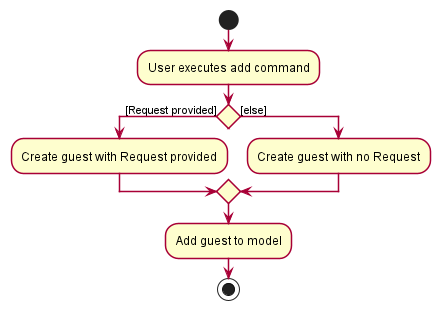

#### Design Considerations:

**Aspect: How to deal with duplicate entries**

* **Alternative 1 (current choice):** Reject any entry with a duplicate name that is case-insensitive.
    * Pros: Easy to implement.
    * Cons: Will have issues with adding people of the same name to GuestBook.

* **Alternative 2:** Allow duplicate entries to be added with no consequences.
    * Pros: Allows for multiple guests of the same full name to be added.
    * Cons: Easy to abuse the command intentionally (to break the program) or unintentionally (accidentally).

Taking into consideration that in small hotels, the chances of getting two guests that have identical full names are
incredibly unlikely, we decided to proceed with Alternative 1.

**Aspect: Excluding `isRoomClean` in the `add` command**
* As adding the guest will be done during check in, the room should by default be cleaned for the guest to immediately
be able to enter their room. Hence, we chose to remove `isRoomClean` as it makes the `add` command unnecessarily longer.

**Aspect: Excluding `Bill` in the `add` command**
* As adding the guest will be done during check in, the guest should not have incurred any bill costs yet. Hence, we set
the initial bill to be 0 and chose to remove `Bill` as it makes the `add` command unnecessarily longer.

**Aspect: Making `Request` in the `add` command**
* As adding the guest will be done during check in, the guest might not have any special requests to make for the room. Hence,
we chose to make `Request` optional and default it as blank should it not be provided.

### Edit Command

#### Implementation:
* The `edit` command takes in an INDEX indicating the index of the guest to edit in the current panel (starting from 1) and 8 optional fields (`Name`, `Phone`, `Email`, `Room`, `Date Range`, `Number of Guests`, `Is Room Clean` and `Request`) and is supported by the `EditCommandParser` that extracts out each of the fields from their respective prefixes.

The following activity diagrams summarizes what happens when a user enters an `edit` command.

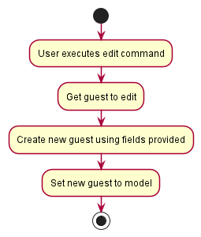

#### Design Considerations:

**Aspect: Allowing only specific fields provided to be edited**
* As the edit command is usually used when there is a change or error in the information provided, it makes more sense for the user to be able to change only selected fields.

**Aspect: Excluding `Bill` in the `edit` command**
* As the `bill` command allows us to add and subtract to the bill directly, the edit command is redundant and may cause user error if they were to replace it by accident.

### Bill Command

#### Implementation:
* The `bill` command takes in an INDEX indicating the index of the guest to edit in the current panel (starting from 1) and the `bill` field and is supported by the `BillCommandParser` that extracts the bill value.

The following activity diagrams summarizes what happens when a user enters a `bill` command.

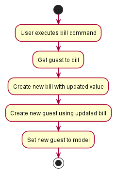

#### Design Considerations:

**Aspect: How to update a bill**
* **Alternative 1:** Set the bill to the input value.
  * Pros: Can be implemented by extending the `edit` command, so that the user does not need to learn an additional command
  * Cons: The user is required to calculate the updated bill value, which is less convenient and intuitive.
* **Alternative 2 (current choice):** Add the input value to the bill.
  * Pros: More aligned with real-life implementation of bills, by adding the next charge. Easy to undo as the previous command is displayed.
  * Cons: Addition method must be implemented, and negative values must be accepted.
* **Alternative 3:** Allow both depending on syntax.
  * Pros: Flexibility for user, such as resetting the bill to 0 or another known value if needed.
  * Cons: Syntax may be confusing and complex to implement.

Taking into consideration the much higher probability of the user using the bill command to add a value as compared to setting the value,
and that minimal calculation is needed to reset the bill to 0 (`b/-CURRENT_VALUE`), we decided to proceed with Alternative 2.

**Aspect: Accepting signed and unsigned positive values**
* As the user may prefer to see `+` differentiating positive and negative values, or leave out the `+` sign for convenience, we decided to accept both formats for positive values.

**Aspect: Using the `b/` prefix**
* To standardise the formatting and testing for field inputs, we decided to include the `b/` prefix in the command syntax.

### MarkRoomsUnclean Command

#### Implementation
* The `markRoomsUnclean` command edits all the guests in GuestBook and changes their isRoomClean statuses to "no". It takes in no additional inputs or fields.

The following activity diagram summarizes what happens when a user enters a `markRoomsUnclean` command.

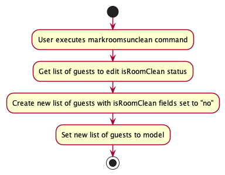

#### Design Considerations:
**Aspect: The scope at which the command changes all guests' isRoomClean statuses**
* Alternative 1: Allow `markRoomsUnclean` command to operate only on the last shown list instead of the entire list. This is to Standardise how edits are made across the commands (e.g. edit and delete).
  * Pros: This might be more intuitive for users, as `edit` and `delete` commands work only on the last shown lists.
  * Cons: User is unable to change all the guests' isRoomClean statuses in a single command.
* Alternative 2 (current choice): Allow `markRoomsUnclean` command to change all guests' isRoomClean statuses in GuestBook instead of the last shown list.
  * Pros: User is able to change all the guests' isRoomClean statuses in a single command.
  * Cons: There is less flexibility in marking groups of guests' room as unclean.

Taking into consideration the context of GuestBook that operates for small hotels, it is unlikely to have a case in which the user has to mark different groups of guests' isRoomClean statuses differently as the types of rooms as mostly homogenous.

### Find Command

#### Implementation:
* The `find` command takes in multiple keywords separated by spaces, and find all guests whose `fields` contain any of the keywords. The keywords are case-insensitive as well. As such, entering 'Alice' is the same as entering 'aLiCE'.

The following activity diagram summarizes what happens when a user enters a `find` command.

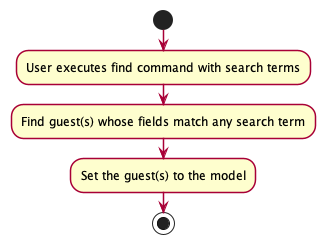

#### Design Considerations:

**Aspect: Allowing searching only through all fields**
* As the hotel manager would usually appreciate the ability to search by other fields such as by Room, it is appropriate to make the `find` command to scan through all the fields of the guests.

**Aspect: Only matching full keywords**
* The `find` command only matches full keywords. For example, typing in 'ali' would not match a Guest named 'Alice'. As we do not want to display possible redundant data to the hotel manager, we decided to limit the `find` command to only full keywords, so that the results displayed are more targeted.

### \[Proposed\] Undo/Redo Command

#### Proposed Implementation

The proposed undo/redo mechanism is facilitated by `VersionedGuestBook`. It extends `GuestBook` with an undo/redo history, stored internally as an `guestBookStateList` and `currentStatePointer`. Additionally, it implements the following operations:

* `VersionedGuestBook#commit()` — Saves the current GuestBook state in its history.
* `VersionedGuestBook#undo()` — Restores the previous GuestBook state from its history.
* `VersionedGuestBook#redo()` — Restores a previously undone GuestBook state from its history.

These operations are exposed in the `Model` interface as `Model#commitGuestBook()`, `Model#undoGuestBook()` and `Model#redoGuestBook()` respectively.

Given below is an example usage scenario and how the undo/redo mechanism behaves at each step.

Step 1. The user launches the application for the first time. The `VersionedGuestBook` will be initialized with the initial GuestBook state, and the `currentStatePointer` pointing to that single GuestBook state.

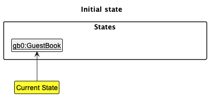

Step 2. The user executes `delete 5` command to delete the 5th guest in GuestBook. The `delete` command calls `Model#commitGuestBook()`, causing the modified state of GuestBook after the `delete 5` command executes to be saved in the `guestBookStateList`, and the `currentStatePointer` is shifted to the newly inserted GuestBook state.

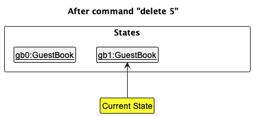

Step 3. The user executes `add n/David …​` to add a new guest. The `add` command also calls `Model#commitGuestBook()`, causing another modified GuestBook state to be saved into the `guestBookStateList`.

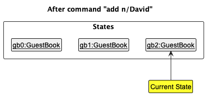

:information_source: **Note:** If a command fails its execution, it will not call `Model#commitGuestBook()`, so the GuestBook state will not be saved into the `guestBookStateList`.

Step 4. The user now decides that adding the guest was a mistake, and decides to undo that action by executing the `undo` command. The `undo` command will call `Model#undoGuestBook()`, which will shift the `currentStatePointer` once to the left, pointing it to the previous GuestBook state, and restores the GuestBook to that state.

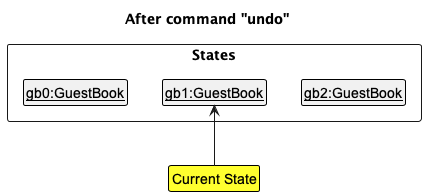

:information_source: **Note:** If the `currentStatePointer` is at index 0, pointing to the initial GuestBook state, then there are no previous GuestBook states to restore. The `undo` command uses `Model#canUndoGuestBook()` to check if this is the case. If so, it will return an error to the user rather
than attempting to perform the undo.

The following sequence diagram shows how the undo operation works:

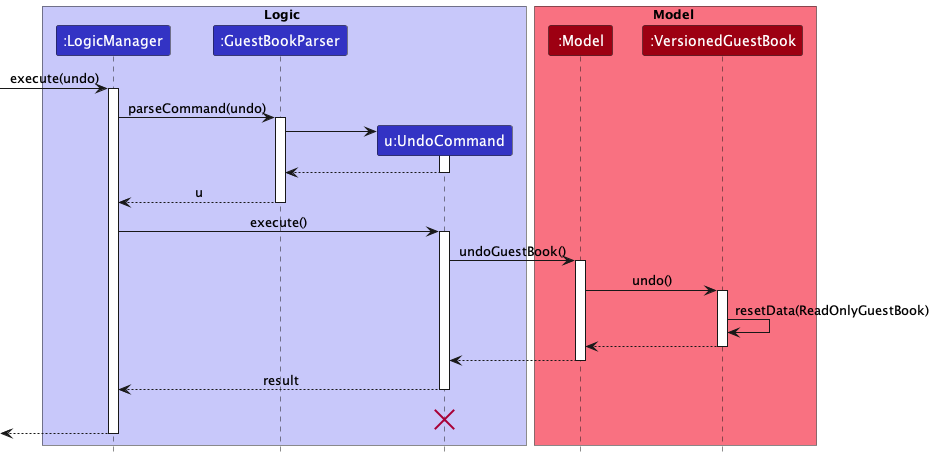

:information_source: **Note:** The lifeline for `UndoCommand` should end at the destroy marker (X) but due to a limitation of PlantUML, the lifeline reaches the end of diagram.

The `redo` command does the opposite — it calls `Model#redoGuestBook()`, which shifts the `currentStatePointer` once to the right, pointing to the previously undone state, and restores GuestBook to that state.

:information_source: **Note:** If the `currentStatePointer` is at index `guestBookStateList.size() - 1`, pointing to the latest GuestBook state, then there are no undone GuestBook states to restore. The `redo` command uses `Model#canRedoGuestBook()` to check if this is the case. If so, it will return an error to the user rather than attempting to perform the redo.

Step 5. The user then decides to execute the command `list`. Commands that do not modify GuestBook, such as `list`, will usually not call `Model#commitGuestBook()`, `Model#undoGuestBook()` or `Model#redoGuestBook()`. Thus, the `guestBookStateList` remains unchanged.

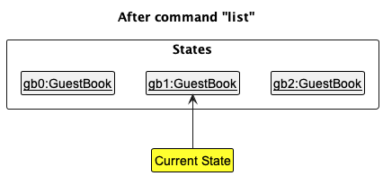

Step 6. The user executes `clear`, which calls `Model#commitGuestBook()`. Since the `currentStatePointer` is not pointing at the end of the `guestBookStateList`, all GuestBook states after the `currentStatePointer` will be purged. Reason: It no longer makes sense to redo the `add n/David …​` command. This is the behavior that most modern desktop applications follow.

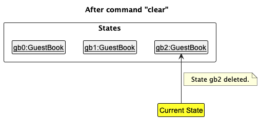

The following activity diagram summarizes what happens when a user executes a new command:

#### Design Considerations:

**Aspect: How undo & redo executes:**

* **Alternative 1 (current choice):** Saves the entire GuestBook.
  * Pros: Easy to implement.
  * Cons: May have performance issues in terms of memory usage.

* **Alternative 2:** Individual command knows how to undo/redo by
  itself.
  * Pros: Will use less memory (e.g. for `delete`, just save the guest being deleted).
  * Cons: We must ensure that the implementation of each individual command are correct.

_{more aspects and alternatives to be added}_

### \[Proposed\] Data Archiving

_{Explain here how the data archiving feature will be implemented}_

--------------------------------------------------------------------------------------------------------------------

## **Documentation, logging, testing, configuration, dev-ops**

* [Documentation guide](Documentation.md)
* [Testing guide](Testing.md)
* [Logging guide](Logging.md)
* [Configuration guide](Configuration.md)
* [DevOps guide](DevOps.md)

--------------------------------------------------------------------------------------------------------------------

## **Appendix: Requirements**

### Product scope

**Target user profile**:
* hotel manager of a small-sized hotel
* hotel manager who want to keep track of guests
* has a need to manage a significant number of guests
* prefer desktop apps over other types
* can type fast
* prefers typing to mouse interactions
* is reasonably comfortable using CLI apps

**Value proposition**:
* To know when the guests check in and check out
* To keep track of the guests' bills
* To note down all the requirements/requests that the guests asked for
* To note down the status of the room, if the room is cleaned or not cleaned

### User stories

Priorities: High (must have) - `* * *`, Medium (nice to have) - `* *`, Low (unlikely to have) - `*`

| Priority | As a …​                  | I want to …​                                                       | So that I can…​                                                                           |
|----------|--------------------------|--------------------------------------------------------------------|-------------------------------------------------------------------------------------------|
| `* * *`  | first time hotel manager | know the available commands                                        | use the application to its full capabilities                                              |
| `* * *`  | hotel manager            | view a list of all the guests                                      | browse all my guests' data at once                                                        |
| `* * *`  | hotel manager            | view the contact number of the guest                               | contact them in an emergency                                                              |
| `* * *`  | hotel manager            | view the name of the guest                                         | verify the guest                                                                          |
| `* * *`  | hotel manager            | view the email address of the guest                                | contact the guest via email                                                               |
| `* * *`  | hotel manager            | be able to exit the program                                        | close it when I do not need to use it                                                     |
| `* * *`  | first time hotel manager | be able to delete data of all guests at one go                     | have a clean slate to work on should I need to                                            |
| `* * *`  | hotel manager            | view the check-in date of a guest                                  | prepare the room for the incoming guests                                                  |
| `* * *`  | hotel manager            | view the check-out date of a guest                                 | prepare when to clean the room                                                            |
| `* * *`  | hotel manager            | delete a guest after they check out of my hotel                    | do not keep unnecessary data on my guests                                                 |
| `* * *`  | hotel manager            | be able to save the details of the guests                          | the data is not lost between sessions                                                     |
| `* * *`  | hotel manager            | search guests by keyword                                           | see details of specific guests                                                            |
| `* * *`  | hotel manager            | view the number of guests in each room                             | prepare proper bed suites                                                                 |
| `* * *`  | hotel manager            | add the details of a new guest when they are staying at my hotel   | know the details of who is staying at my hotel                                            |
| `* * *`  | hotel manager            | be able to edit the name of the guest                              | update it if there are any changes                                                        |
| `* * *`  | hotel manager            | be able to edit the email address of the guest                     | update it if there are any changes                                                        |
| `* * *`  | hotel manager            | be able to edit the number of guests                               | update it if there are any changes                                                        |
| `* * *`  | hotel manager            | be able to edit the check-in and check-out date range of the guest | update it if there are any changes                                                        |
| `* * *`  | hotel manager            | be able to edit the contact number of the guest                    | update it if there are any changes                                                        |
| `* *`    | hotel manager            | get the details of the bill of the hotel guest                     | charge the guest the right amount                                                         |
| `* *`    | hotel manager            | be able to add to the bill of the hotel guest                      | update it if there are any changes                                                        |
| `* *`    | hotel manager            | be able to deduct from the bill of the hotel guest                 | update it if there are any changes                                                        |
| `* *`    | hotel manager            | view if a room has been cleaned                                    | allocate my cleaners cleaning duties                                                      |
| `* *`    | hotel manager            | mark a room as clean                                               | my cleaners will not need to waste time cleaning the room again                           |
| `* *`    | hotel manager            | mark a room as not clean                                           | my cleaners will know which room to clean                                                 |
| `* *`    | hotel manager            | get the details of any special requests from the guests            | serve the guest as requested                                                              |
| `* *`    | hotel manager            | mark all the rooms as not cleaned at one go                        | save time from editing all the guests in GuestBook as cleaning of rooms is a daily affair |
| `* `     | hotel manager            | get the details of where the guests booked their hotel stay from   | decide which booking platform I need to pay more attention to                             |
| `* `     | hotel manager            | get the details of how many guests are eating breakfast            | prepare the appropriate amount of food                                                    |
| `* `     | hotel manager            | get the details of how many guests are eating lunch                | prepare the appropriate amount of food                                                    |
| `* `     | hotel manager            | get the details of how many guests are eating dinner               | prepare the appropriate amount of food                                                    |

*{More to be added}*

### Use cases

(For all use cases below, the **System** is the `GuestBook` and the **Actor** is the `user`, unless specified otherwise)

**Use case 1: Add a guest**

**MSS**

1. User requests to add a guest to the list with guest's details.
2. System adds the guest.

    Use case ends.

**Extensions**
* 2a. The guest is already exists in the list of guests.

    Use case ends.

* 3a. The input data is invalid.

  * 3a1. System shows an error message.
  
    Use case resumes at step 2.

**Use case 2: Search for a guest**

**MSS**

1. User requests to search by for guest.
2. System returns the guest.

   Use case ends.

**Extensions**
* 2a. The guest is does not exist in the system.

  Use case ends.

* 2a. The search data is invalid.

    * 3a1. System shows an error message.

      Use case resumes at step 2.

**Use case 3: Update a guest's details**

**MSS**

1. User searches for guest (Use case 2).
2. User requests to edit a guest's details.
3. System updates the guest.

   Use case ends.

**Extensions**
* 2a. The edit data is invalid.

    * 3a1. System shows an error message.

      Use case resumes at step 2.

**Use case 4: Delete a guest**

**MSS**

1.  User requests to list guests.
2.  System shows a list of guests.
3.  User requests to delete a specific guest in the list.
4.  System deletes the guest.

    Use case ends.

**Extensions**

* 2a. The list is empty.

  Use case ends.

* 3a. The given index is invalid.

    * 3a1. System shows an error message.

      Use case resumes at step 2.

**Use case 5: Get list of all guests**

**MSS**

1.  User requests to list guests.
2.  System shows a list of guests.

    Use case ends.

**Extensions**

* 2a. The list is empty.

  Use case ends.

**Use case 6: Mark room clean status to "no" of all guests**

**MSS**

1. User requests to mark all guests' room clean statuses to "no".
2. System updates all guests' room clean statuses to "no".

    Use case ends.

**Use case 7: Add or deduct to a guest's bill**

**MSS**

1. User <u>searches for guest (Use case 2)</u>.
2. User requests to add or deduct to a guest's bill.
3. System add or deduct to original guest's bill.

   Use case ends.

**Extensions**
* 2a. The update data is invalid.

    * 3a1. System shows an error message.

      Use case resumes at step 2.

**Use case 8: Exit the program**

**MSS**

1. User requests exit the program
3. System exits the program

    Use case ends.

### Non-Functional Requirements

1. Should work on any _mainstream OS_ as long as it has Java `11` or above installed.
2. Should be able to hold up to 1000 guests without a noticeable sluggishness in performance for typical usage.
3. A user with above average typing speed for regular English text (i.e. not code, not system admin commands) should be able to accomplish most of the tasks faster using commands than using the mouse.
4. The response to any use action should become visible within 5 seconds.
5. The number of guests a user enters should not exceed 4.
6. The guests should have a check-out date.
7. The guest cannot stay for a period longer than 1 year.
8. Data should be saved into a JSON file before exiting the program.
9. The project is expected to adhere to a schedule that delivers a feature set every two weeks.

### Glossary

* **Mainstream OS**: Windows, Linux, Unix, OS-X
* **Number of guests**: Refers to the total number of people staying in the hotel room
* **Guest**: Refers to the guest who booked the hotel room.

--------------------------------------------------------------------------------------------------------------------

## **Appendix: Instructions for manual testing**

Given below are instructions to test the app manually.

:information_source: **Note:** These instructions only provide a starting point for testers to work on;
testers are expected to do more *exploratory* testing.

### Launch and shutdown

1. Initial launch

   1. Download the jar file and copy into an empty folder

   1. Double-click the jar file Expected: Shows the GUI with a set of sample guests. The window size may not be optimum.

1. Saving window preferences

   1. Resize the window to an optimum size. Move the window to a different location. Close the window.

   1. Re-launch the app by double-clicking the jar file. 
       Expected: The most recent window size and location is retained.

1. _{ more test cases …​ }_

### Deleting a guest

1. Deleting a guest while all guests are being shown

   1. Prerequisites: List all guests using the `list` command. Multiple guests in the list.

   1. Test case: `delete 1` 
      Expected: First guest is deleted from the list. Details of the deleted guest shown in the status message. Timestamp in the status bar is updated.

   1. Test case: `delete 0` 
      Expected: No guest is deleted. Error details shown in the status message. Status bar remains the same.

   1. Other incorrect delete commands to try: `delete`, `delete x`, `...` (where x is larger than the list size) 
      Expected: Similar to previous.

1. _{ more test cases …​ }_

### Saving data

1. Dealing with missing/corrupted data files

   1. _{explain how to simulate a missing/corrupted file, and the expected behavior}_

1. _{ more test cases …​ }_

### Adding a guest

1. Adding a guest

   1. Prerequisites: Only one guest to be added.
      The name of the guest to be added should not exist in GuestBook.
   The format and data of the command should be valid.

   2. Test case: `add n/John Doe p/98765432 e/johnd@example.com rm/05-73
                  dr/13/09/22 - 15/09/22 ng/1 rq/Apply for room service ` 
      Expected: Guest add successfully

   3. Test case: `add n/John Doe p/98765431 e/johnd@nus.com rm/06-73
                  dr/13/09/22 - 15/09/23 ng/1 rq/Kill the insect ` 
      Expected: No guest is added,
      because the name is already in GuestBook. Error details shown in the status message.
         Status bar remains the same.

   4. Test case: `add n/John@y Doe p/98765431 e/johnd@nus.com rm/06-73
                  dr/13/09/22 - 15/09/23 ng/1 rq/Kill the insect ` 
      Expected: No guest is added, because the name is invalid. Error details shown in the status message.
      Status bar remains the same.

   5. Test case: `add n/Johnny Doe p/+65431 e/johnd@nus.com rm/06-73
                  dr/13/09/22 - 15/09/23 ng/1 rq/Kill the insect ` 
      Expected: No guest is added, because the phone number is invalid. Error details shown in the status message.
      Status bar remains the same.

   6. Test case: `add n/Johnny Doe p/98765431 e/nus.com rm/06-73
                  dr/13/09/22 - 15/09/23 ng/1 rq/Kill the insect ` 
      Expected: No guest is added, because the email address is invalid. Error details shown in the status message.
      Status bar remains the same.

   7. Test case: `add n/Johnny Doe p/98765431 e/johnd@nus.com rm/!06-73
                  dr/13/09/22 - 15/09/23 ng/1 rq/Kill the insect ` 
      Expected: No guest is added, because the room is invalid. Error details shown in the status message.
      Status bar remains the same.

   8. Test case: `add n/Johnny Doe p/98765431 e/johnd@nus.com rm/06-73
                  dr/13/09/22 - 13/09/23 ng/1 rq/Kill the insect ` 
      Expected: No guest is added, because the date range is invalid. Error details shown in the status message.
      Status bar remains the same.

   9. Test case: `add n/Johnny Doe p/98765431 e/johnd@nus.com rm/06-73
                  dr/13/09/22 - 15/09/23 ng/5 rq/Kill the insect ` 
      Expected: No guest is added, because the number of guest is invalid(>4).
      Error details shown in the status message.
         Status bar remains the same.

   10. Test case: `add n/Johnny Doe p/98765431 e/johnd@nus.com rm/06-73
                   dr/13/09/22 - 15/09/23 ng/1 rq/Kill the insect ` 
       Expected: No guest is added, because the is room clean is invalid. Error details shown in the status message.
       Status bar remains the same.

   let INVALID_REQUEST be a string of 501 characters long.
   11. Test case: `add n/Johnny Doe p/98765431 e/johnd@nus.com rm/06-73
       dr/13/09/22 - 15/09/23 ng/1 rq/INVALID_REQUEST ` 
       Expected: No guest is added, because the request is invalid(>500 characters).
       Status bar remains the same.

### Editing a guest

1. Editing a guest
   
   1. Prerequisite: Only 1 guest to be edited; the guest's index should exist.
   The guest should exist in GuestBook.
   The format and content of the command should be valid.

   2. Test case: `edit 1 n/Johnny` 
      Expected: Guest edit successfully, the first guest's name will change from "John Doe" to "Johnny"

   3. Test case: `edit 99999 n/Johnny` 
      Expected: No guest is edited, because the input index does not exist. Error details shown in the status message.

   4. Test case: `edit 1 n/Jo@` 
      Expected: No guest is edited, because the name is invalid. Error details shown in the status message.
      Status bar remains the same.

   5. Other incorrect edit commands to try: `edit`, `edit x`, `edit 1 rc/hi`, `...` 
      Expected: Similar to previous.
